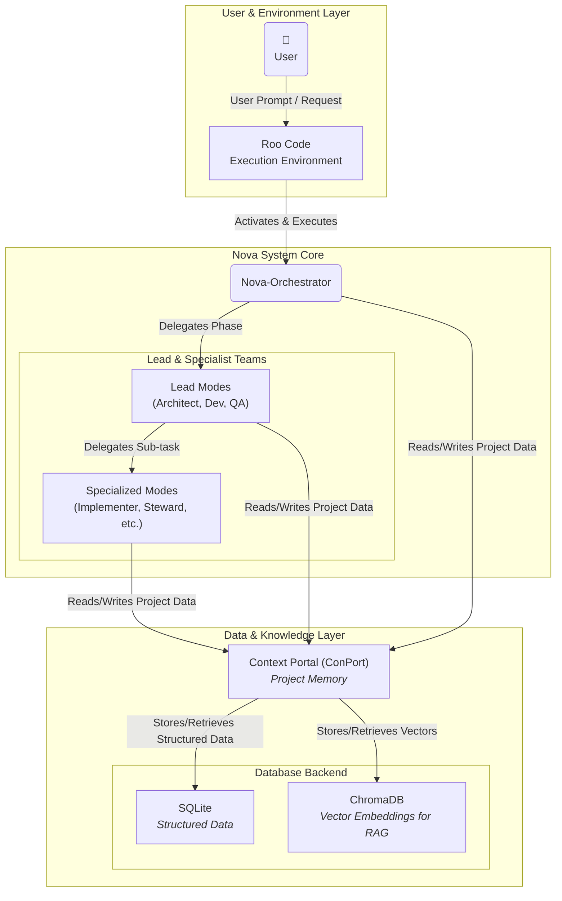
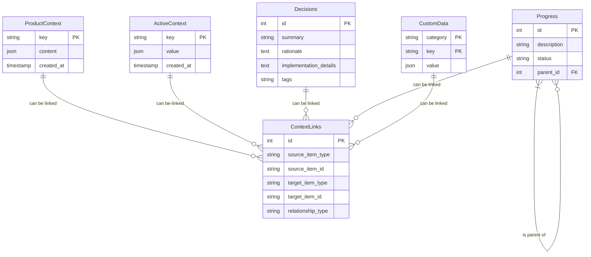
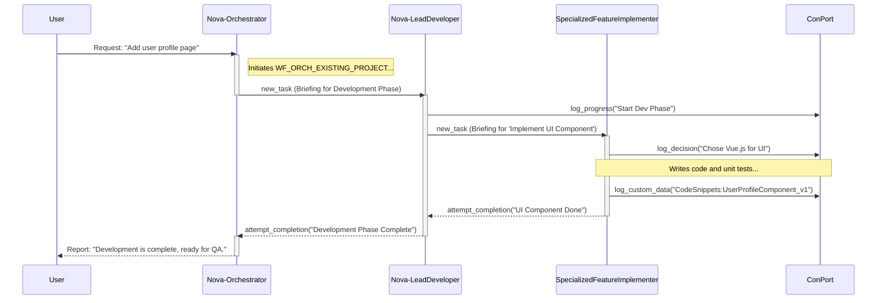
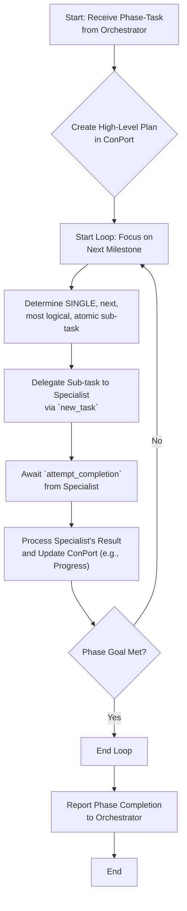
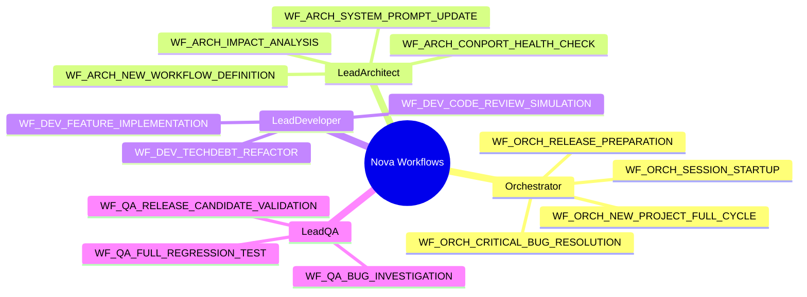
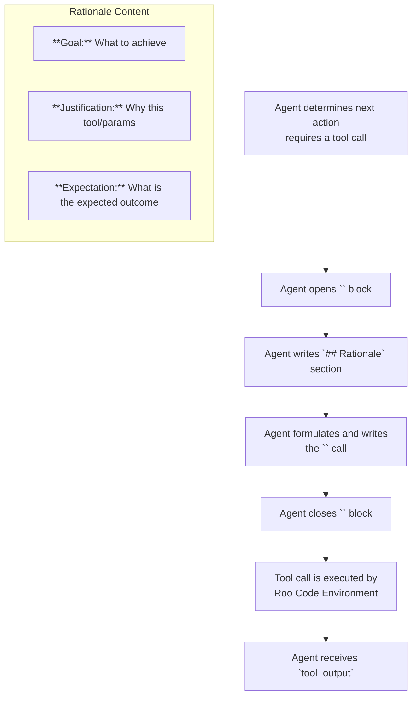
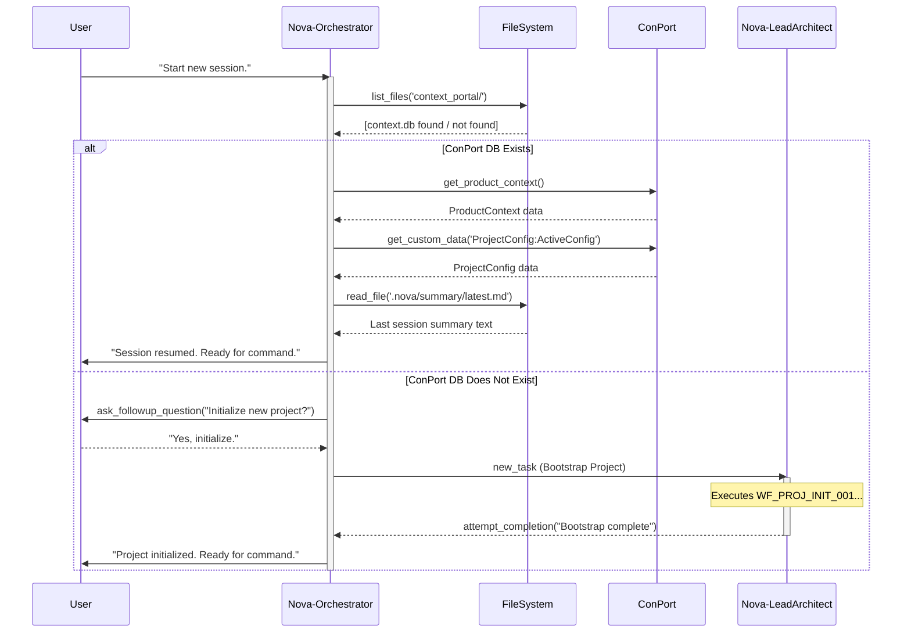

# Nova System: An Architectural Deep Dive & Visualizations

## Introduction

This document provides a detailed architectural analysis of the Nova System, a sophisticated, AI-driven framework designed for managing and executing complex software development projects. The system is built upon a hierarchical model of specialized AI agents (referred to as "modes") that collaborate under the direction of a central `Nova-Orchestrator`.

The core principles of the Nova System are structured project execution, explicit knowledge retention, and efficient task delegation. Its memory and "single source of truth" is the **Context Portal (ConPort)**, a project-specific knowledge graph. All operations are guided by **Workflows**, which are standardized, documented processes stored as Markdown files.

The following visualizations dissect the system's key components, data structures, and interaction patterns to provide a clear and comprehensive understanding of its inner workings.

---

### 1. High-Level System Architecture

This C4-style context diagram provides a bird's-eye view of the Nova System's ecosystem. It illustrates the primary components and their relationships, showing how the system interacts with the user and its core data layer within its execution environment.

- **User & Environment:** The `User` interacts with the system through a `Roo Code Execution Environment` (like the VS Code extension), which is responsible for activating the appropriate AI modes.
- **Nova System Core:** The `Nova-Orchestrator` is the central point of contact, delegating entire project phases to `Lead Modes`. These Leads, in turn, break down phases into atomic sub-tasks for their teams of `Specialized Modes`.
- **Data & Knowledge Layer:** All modes interact with the `Context Portal (ConPort)`, the system's central memory. ConPort utilizes `SQLite` for structured data and `ChromaDB` for vector embeddings, enabling powerful semantic search and Retrieval Augmented Generation (RAG).

---

### 2. Context Portal (ConPort) Data Model

This Entity Relationship Diagram (ERD) reveals the structure of the system's memory. It models the core data entities within ConPort's SQLite database, showcasing how project knowledge is captured and organized. The `ContextLinks` table is the critical component that transforms these entities from isolated data points into a richly interconnected knowledge graph, enabling complex queries and contextual understanding.

- **Key Entities:** `ProductContext` and `ActiveContext` hold high-level and session-specific state. `Decisions` and `Progress` track strategic choices and task status. `CustomData` is a flexible key-value store for everything from `ProjectConfig` to `ErrorLogs`.
- **The Knowledge Graph:** The `ContextLinks` entity explicitly defines relationships (e.g., "implements," "tested_by," "caused_by") between any two items in the database, forming the graph's edges.

---

### 3. Feature Implementation Lifecycle

This sequence diagram visualizes the end-to-end process of implementing a new feature, as defined in `WF_ORCH_EXISTING_PROJECT_NEW_FEATURE_E2E_001_v1.md`. It highlights the formal, hierarchical delegation from the user's request down to the specialist level. The diagram emphasizes the structured communication protocol, where `new_task` calls carry a formal `Subtask Briefing Object` and `attempt_completion` calls serve as formal reports. ConPort is actively read from and written to at every stage, acting as the shared state manager.

---

### 4. The Lead Mode "Single-Step Loop"

This flowchart illustrates the fundamental execution logic for all Lead Modes (`-LeadArchitect`, `-LeadDeveloper`, `-LeadQA`) in the v3 architecture. This "Single-Step Loop" is a cornerstone of system reliability. Instead of planning and delegating a complex series of tasks upfront, the Lead Mode creates a coarse-grained plan and then iteratively determines and delegates only the _single, next, most logical sub-task_. This "just-in-time" approach makes agent behavior more predictable, reduces the risk of error in complex briefings, and increases overall system robustness.

---

### 5. The Workflow Ecosystem

This mindmap provides a conceptual overview of the standardized processes, or "Workflows," that govern the Nova System's operations. It visualizes the division of labor, showing how workflows are owned by different actors in the hierarchy. The `Orchestrator` manages high-level, cross-functional processes, while each `Lead Mode` owns workflows specific to its domain (architecture, development, or QA), which they use to guide their teams.

---

### 6. The "Auditable Rationale" Protocol

This flowchart visualizes the "Auditable Rationale Protocol," a mandatory process for every agent in the v3 system. It serves as a "flight recorder" for the agent's reasoning. Before _every_ tool call, the agent must explicitly document its Goal, Justification, and Expectation in its internal `<thinking>` block. This protocol is the key to system traceability, providing invaluable insight for debugging, analysis, and understanding the system's decision-making process for every action it takes.

---

### 7. Session Start & Context Resumption

This sequence diagram models the critical boot-up procedure detailed in `WF_ORCH_SESSION_STARTUP_AND_CONTEXT_RESUMPTION_001_v1.md`. It shows how the `Nova-Orchestrator` intelligently handles the start of any new user session. The process is robust, featuring conditional logic to either load the state from an existing ConPort database or, if one is not found, to orchestrate a full project bootstrap by delegating to `Nova-LeadArchitect`. This ensures seamless continuity between sessions or a structured start for new projects.

## Conclusion

The Nova System is designed around several key architectural principles:

1.  **Hierarchical Delegation:** Tasks flow from high-level user goals down to granular, specialist actions.
2.  **Structured Communication:** Formal `new_task` briefings and `attempt_completion` reports minimize ambiguity.
3.  **Centralized Knowledge:** The `Context Portal (ConPort)` acts as a single, shared brain, enabling state retention and complex contextual reasoning.
4.  **Standardized Processes:** `Workflows` codify best practices, ensuring consistent and repeatable project execution.
5.  **Auditable Rationale:** The mandatory rationale protocol provides complete transparency into the decision-making process of every agent.

Together, these principles create a robust, traceable, and highly-organized framework for AI-driven software development.
