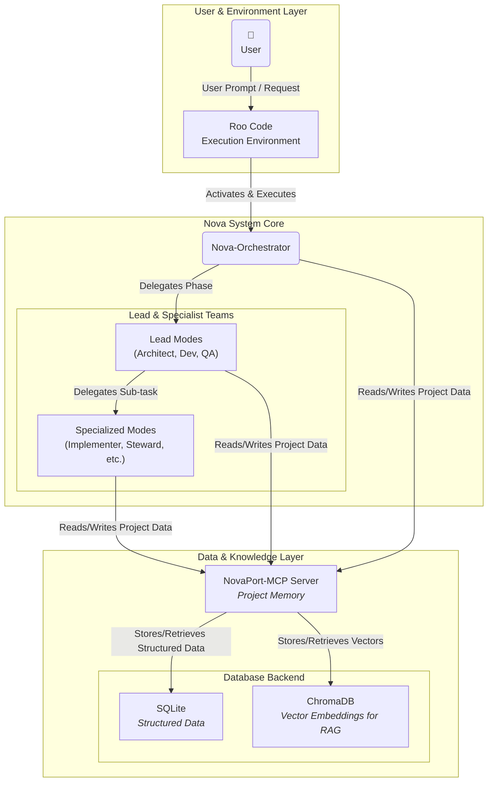
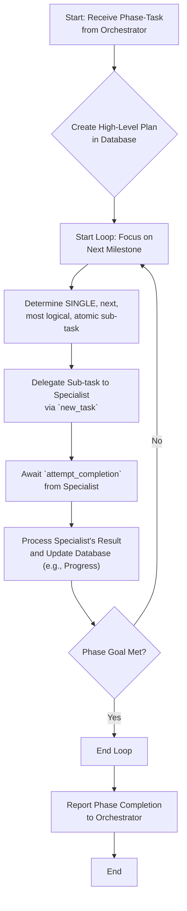
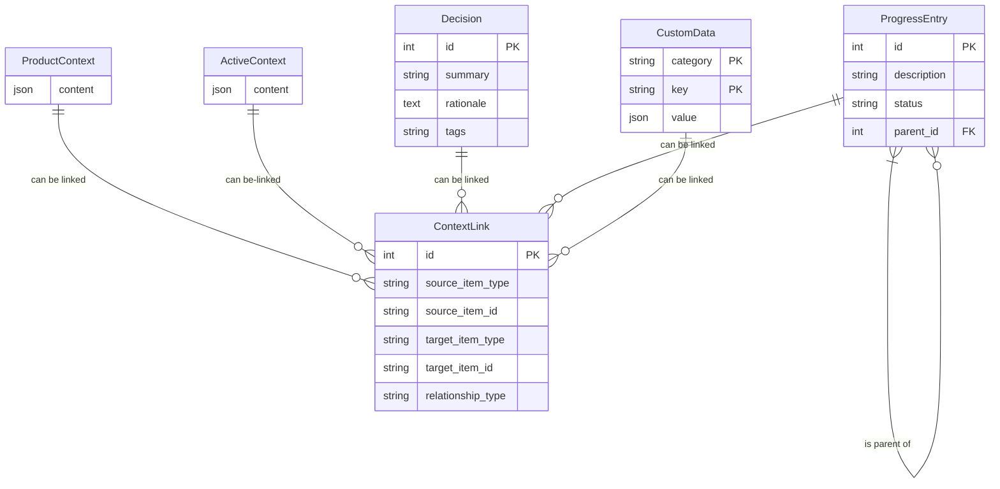

# Nova System: Overview and Operation

<br>

> **WARNING: EXPERIMENTAL CUSTOM SYSTEM PROMPTS ACTIVE**
>
> This Nova System configuration utilizes custom system prompts for its AI modes. As highlighted in the Roo Code documentation on "Footgun Prompting", operating with custom system prompts is an experimental feature.
>
> **This can severely disrupt functionality and lead to unpredictable or unstable behavior.** Proceed with caution and awareness of potential instability. It is recommended to have a strong understanding of the Roo Code execution model and the implications of custom prompting before extensive use.

<br>

## Table of Contents

1.  [Installation](#installation)
2.  [Dependencies & Setup](#dependencies--setup)
3.  [Quick Start: Your First Interaction](#quick-start-your-first-interaction)
4.  [Configuration](#configuration)
5.  [Introduction](#introduction)
6.  [Core Concepts](#core-concepts)
    - [System Architecture & Communication Flow](#system-architecture--communication-flow)
    - [NovaPort-MCP (The Project Memory)](#novaport-mcp-the-project-memory)
    - [Nova Modes](#nova-modes)
    - [Workflows](#workflows)
    - [Delegation and Communication](#delegation-and-communication)
    - [Workspace](#workspace)
    - [Knowledge Graph & RAG](#knowledge-graph--rag)
    - [Prompt Caching](#prompt-caching)
    - [Auditable Rationale (v3)](#auditable-rationale-v3)
7.  [Nova Modes in Detail](#nova-modes-in-detail)
    - [Nova-Orchestrator (Roo)](#nova-orchestrator-roo)
    - [Lead Modes](#lead-modes)
      - [Lead Mode Execution Logic (v3 Single-Step Loop)](#lead-mode-execution-logic-v3-single-step-loop)
      - [Nova-LeadArchitect](#nova-leadarchitect)
      - [Nova-LeadDeveloper](#nova-leaddeveloper)
      - [Nova-LeadQA](#nova-leadqa)
    - [Specialized Modes](#specialized-modes)
      - [Proactive Linking (v3)](#proactive-linking-v3)
      - [Architect Team](#architect-team)
      - [Developer Team](#developer-team)
      - [QA Team](#qa-team)
    - [Utility Mode](#utility-mode)
      - [Nova-FlowAsk](#nova-flowask)
8.  [Workflows (`.nova/workflows/`)](#workflows-novaworkflows)
    - [Orchestrator Workflows](#orchestrator-workflows)
    - [Lead Mode Workflows](#lead-mode-workflows)
9.  [NovaPort-MCP - The Memory](#novaport-mcp---the-memory)
    - [Purpose and Architecture](#purpose-and-architecture)
    - [Core Data Entities](#core-data-entities)
    - [Key Configuration Items](#key-configuration-items)
    - [MCP Tool Interaction](#mcp-tool-interaction)
10. [Important Considerations & Experimental Nature](#important-considerations--experimental-nature)
11. [Key Operational Principles](#key-operational-principles)
12. [Session Management](#session-management)
13. [Foundations and Acknowledgements](#foundations-and-acknowledgements)

## Installation

The installer scripts allow you to choose which version of the Nova System you want to install. You can select the latest stable release, the latest pre-release, the cutting-edge development version, or a specific version tag.

The installer will automatically download the core system files: `.roomodes`, `README.md`, the entire `.nova` directory, and the `.roo` directory.

### Choosing a Version

- **`latest-prerelease` (Recommended Default):** Installs the most recent pre-release version (e.g., `v0.4.0-beta`). This is the best choice for users who want access to the latest features that are in the final stages of testing.
- **`latest`:** Installs the most recent **stable** release. This is the safest option, recommended for production-like environments or users who prioritize stability over the newest features.
- **`main`:** Installs the latest version from the `main` branch, which represents the stable base for the next release.
- **`dev`:** Installs the absolute latest commit from the `dev` branch. This version is potentially unstable and should only be used by developers contributing to the Nova System itself or those who need cutting-edge changes immediately.
- **`[specific_tag]`:** Installs a specific version by its tag name, for example, `v0.3.4-beta`.

---

### **macOS / Linux (Bash)**

First, download the installer script:

```bash
curl -O https://raw.githubusercontent.com/Siroopfles/NovaPort/main/scripts/install_nova_modes.sh
chmod +x install_nova_modes.sh
```

Now, run the script with the desired version.

- **To Install Latest Pre-Release (Recommended):**

  ```bash
  ./install_nova_modes.sh latest-prerelease
  ```

  _(If no version is specified, the script defaults to this)_

- **To Install Latest Stable Release:**

  ```bash
  ./install_nova_modes.sh latest
  ```

- **To Install from the `dev` branch:**

  ```bash
  ./install_nova_modes.sh dev
  ```

- **To Install a Specific Version (e.g., v0.3.4-beta):**
  ```bash
  ./install_nova_modes.sh v0.3.4-beta
  ```

> **Note:** The script requires `curl` and `jq` to be installed.

---

### **Windows (PowerShell)**

First, download the installer script:

```powershell
Invoke-WebRequest -Uri https://raw.githubusercontent.com/Siroopfles/NovaPort/main/scripts/install_nova_modes.ps1 -OutFile "install_nova_modes.ps1"
```

Now, run the script with the desired version using the `-Version` parameter.

- **To Install Latest Pre-Release (Recommended):**

  ```powershell
  .\install_nova_modes.ps1 -Version latest-prerelease
  ```

  _(If no version is specified, the script defaults to this)_

- **To Install Latest Stable Release:**
  ```powershell
  .\install_nova_modes.ps1 -Version latest
  ```
- **To Install from the `dev` branch:**

  ```powershell
  .\install_nova_modes.ps1 -Version dev
  ```

- **To Install a Specific Version (e.g., v0.3.4-beta):**
  ```powershell
  .\install_nova_modes.ps1 -Version v0.3.4-beta
  ```

> **Note:** If you encounter an error about execution policies, you may need to run this command first: `Set-ExecutionPolicy -ExecutionPolicy Bypass -Scope Process`.

## Dependencies & Setup

Before you can run the Nova System, its core dependency, the **NovaPort-MCP** server, must be installed and configured.

1.  **A Roo Code Compatible Environment:** The system is designed to be run by an AI agent framework like Roo Code. This documentation assumes you are using the Roo Code extension within Visual Studio Code.

2.  **NovaPort-MCP Server Setup:** The Nova System's memory is powered by the NovaPort-MCP server.
    - **Step A: Install the Backend:**
      You must first clone and install the `novaport-mcp` backend. You can find the full installation instructions at its official repository:
      **[https://github.com/Siroopfles/novaport-mcp](https://github.com/Siroopfles/novaport-mcp)**
      
      A quick summary of the installation is:
      ```bash
      # 1. Clone the repository
      git clone https://github.com/Siroopfles/novaport-mcp.git
      cd novaport-mcp

      # 2. Install dependencies with Poetry
      # This requires Python 3.11+ and Poetry to be installed.
      poetry install
      ```

    - **Step B: Configure in Roo Code:**
      After installing the backend, you must configure it as an available "MCP Server" within your Roo Code environment. This allows the Roo Code extension to start and manage the server for your project.
      
      In your Roo Code `mcp_settings.json` or your project's `.roo/mcp.json`, add the following `mcpServers` object. **You must replace `<absolute path to your cloned novaport-mcp directory>` with the actual absolute path on your system.**
      
      ```json
      {
        "mcpServers": {
          "novaport-mcp": {
            "command": "poetry",
            "args": [
              "run",
              "conport"
            ],
            "cwd": "<absolute path to your cloned novaport-mcp directory>",
            "disabled": false,
            "description": "The robust, multi-project MCP server for NovaPort."
          }
        }
      }
      ```
      > **Troubleshooting:** If you encounter connection errors, please refer to the "Troubleshooting & Robust Configuration" section in the `novaport-mcp` README for instructions on how to call the Python interpreter directly.

## Quick Start: Your First Interaction

This guide assumes you have successfully installed the Nova System files and completed all steps in the [Dependencies & Setup](#dependencies--setup) section.

#### Step 1: Open Your Project and Select the Mode

Interaction with the Nova System happens within the Roo Code chat interface in VS Code.

1.  Open your project folder in Visual Studio Code.
2.  Open the Roo Code Chat View (typically found in the sidebar).
3.  In the chat window's dropdown menu for selecting an AI mode, choose **`Nova-Orchestrator`**. This is the primary mode for all user communication.

#### Step 2: Send Your First Prompt

With `Nova-Orchestrator` selected, type your initial request into the chat input box and send it.

For example, to start a new session, type:

> `Start a new session and tell me the current project status.`

#### Step 3: Observe and Interact

The Roo Code extension will activate `Nova-Orchestrator`, which will begin its startup sequence.

- **For a Brand New Project:** `Nova-Orchestrator` will detect that the database is empty. It will initiate a setup workflow and ask you follow-up questions in the chat to define the project's core configuration.
- **For an Existing Project:** The orchestrator will load the project's context from NovaPort-MCP and provide a summary of the last session, ready for your next command.

> **Want a step-by-step tutorial?**
> For a guided "Hello, World!" experience, check out our [**Getting Started Guide**](./GETTING_STARTED.md).

See the `examples/example-user-prompts.md` file for more ideas on how to interact with the system.

## Configuration

The Nova System's behavior is controlled by two key configuration items stored as `CustomData` objects within the project's NovaPort-MCP database. These are typically set up during the initial project bootstrap.

- **`ProjectConfig:ActiveConfig`**: Defines project-specific settings, such as the primary programming language, testing frameworks, linter commands, and documentation standards. This ensures that all AI modes operate consistently within the project's technical environment.
- **`NovaSystemConfig:ActiveSettings`**: Configures the behavior of the Nova modes themselves. This can include settings like the frequency of database health checks, triggers for specific workflows, or the default level of strictness for quality gates.

These configurations are managed by the `Nova-LeadArchitect` team via the `WF_ARCH_PROJECT_CONFIG_SETUP_001_v1.md` workflow. For a detailed example of what these configurations can contain, see the `examples/example-project-config.json` file in this repository.

## Introduction

The **Nova System** is an advanced AI-driven framework designed for managing and executing complex software development projects. The system comprises various specialized AI agents (referred to as "modes") that collaborate under the direction of a central orchestrator. Nova aims for structured project execution, explicit knowledge retention, and efficient task delegation.

The core of Nova's knowledge management is the **NovaPort-MCP** server, a project-specific database acting as the central memory and "single source of truth." This component is a from-the-ground-up rewrite of the original Context Portal, designed for stability and modern Python environments. Standardized **Workflows**, stored as Markdown files, define the processes that modes follow for specific tasks or project phases. The overall architecture and mode-based interaction patterns are designed for an execution environment like [Roo Code](https://docs.roocode.com/), leveraging custom system prompts which are an experimental feature (see [Important Considerations & Experimental Nature](#important-considerations--experimental-nature)).

## Core Concepts

### System Architecture & Communication Flow

The Nova System is built on a strict hierarchical model of delegation and reporting. The `Nova-Orchestrator` acts as the central coordinator, delegating high-level project phases. `Lead` modes manage these phases by breaking them down into specific sub-tasks for their teams of `Specialized` modes.

Communication is formalized:

- **Delegation (`new_task`):** Solid lines represent a higher-level mode assigning a task to a lower-level mode.
- **Reporting (`attempt_completion`):** Dotted lines represent a mode reporting the completion of its task back to its superior.

The following diagram illustrates this detailed communication flow:


```mermaid
graph TD
    subgraph "User & Environment Layer"
        User(👤<br/>User)
        RooEnv["Roo Code<br/>Execution Environment"]
    end

    subgraph "Nova System Core"
        direction LR
        Orchestrator(Nova-Orchestrator)
        subgraph "Lead & Specialist Teams"
            LeadModes["Lead Modes<br/>(Architect, Dev, QA)"]
            SpecializedModes["Specialized Modes<br/>(Implementer, Steward, etc.)"]
        end
    end

    subgraph "Data & Knowledge Layer"
        NovaPortMCP["NovaPort-MCP Server<br/><i>Project Memory</i>"]
        subgraph "Database Backend"
            SQLite["SQLite<br/><i>Structured Data</i>"]
            ChromaDB["ChromaDB<br/><i>Vector Embeddings for RAG</i>"]
        end
    end

    User -- "User Prompt / Request" --> RooEnv
    RooEnv -- "Activates & Executes" --> Orchestrator
    Orchestrator -- "Delegates Phase" --> LeadModes
    LeadModes -- "Delegates Sub-task" --> SpecializedModes

    SpecializedModes -- "Reads/Writes Project Data" --> NovaPortMCP
    LeadModes -- "Reads/Writes Project Data" --> NovaPortMCP
    Orchestrator -- "Reads/Writes Project Data" --> NovaPortMCP

    NovaPortMCP -- "Stores/Retrieves Structured Data" --> SQLite
    NovaPortMCP -- "Stores/Retrieves Vectors" --> ChromaDB
```

### NovaPort-MCP (The Project Memory)

NovaPort-MCP is the backbone of the Nova system. It is a workspace-specific database (typically creating a `.novaport_data` directory in your project) that stores all project-related information, from high-level goals and architectural decisions to code snippets, bug reports, and configuration settings. All Nova modes interact with NovaPort-MCP via its standardized Model Context Protocol (MCP) server and its tools (primarily `use_mcp_tool`), ensuring consistency, traceability, and a shared understanding of the project state.

### Nova Modes

Nova modes are specialized AI agents, each with its own `system-prompt-nova-*.md` file defining its identity, responsibilities, tools, and behavioral rules. This configuration uses **custom system prompts**, an experimental feature of the [Roo Code](https://docs.roocode.com/) execution environment. There is a hierarchical structure:

- **Nova-Orchestrator:** The main project coordinator.
- **Lead Modes:** (Nova-LeadArchitect, Nova-LeadDeveloper, Nova-LeadQA) Receive phase-tasks from the Orchestrator and manage their own teams of Specialized Modes.
- **Specialized Modes:** Execute specific, focused sub-tasks under the direction of a Lead Mode.
- **Utility Modes:** (Nova-FlowAsk) Assist other modes with specific, often read-only, tasks like information retrieval or summarization.

Each mode operates sequentially; only one mode is active at any given time.

### Workflows

Workflows are standardized, documented processes stored as Markdown files in the `.nova/workflows/` directory (with subdirectories per mode, e.g., `.nova/workflows/nova-orchestrator/`). They describe the steps, actors, triggers, database interactions, and expected deliverables for executing complex tasks or project phases (e.g., setting up a new project, implementing a feature, resolving a bug). Modes (especially the Orchestrator and Leads) consult these workflows to guide their actions. The `DefinedWorkflows` category in the database stores metadata about these workflow files.

### Delegation and Communication

Communication and task delegation within Nova are structured to maximize clarity and reduce ambiguity.

- **`new_task`:** The primary tool by which a higher-level mode (Orchestrator or Lead) delegates a task to a lower-level mode (Lead or Specialist). To ensure reliability, the `message` parameter MUST be a structured **`Subtask Briefing Object`** (in YAML or JSON format). This object explicitly defines the context, goals, specific instructions, input references (e.g., database item keys), and expected deliverables for the (sub)task. This structured approach is a core principle of the Nova system's robustness.
- **`attempt_completion`:** The standard way a mode (Lead or Specialist) reports the completion of its assigned (phase)task back to its calling mode. The `result` parameter contains a structured summary of outcomes, references to database items created or modified, and any new issues discovered.

### Workspace

Each Nova project operates within a specific workspace, identified by `ACTUAL_WORKSPACE_ID` (typically the absolute path to the project directory). All file operations and NovaPort-MCP interactions are relative to this workspace. NovaPort-MCP creates a separate database and vector store for each workspace, ensuring data isolation.

### Knowledge Graph & RAG

NovaPort-MCP facilitates the creation of a project-specific **knowledge graph** by storing structured entities and allowing explicit, queryable relationships (`ContextLinks`) to be defined between them. This structured knowledge base, along with its Full-Text Search (FTS) and semantic search capabilities (powered by vector embeddings stored in ChromaDB), serves as a powerful backend for **Retrieval Augmented Generation (RAG)**. AI modes can fetch precise, up-to-date context from the database to augment their generative tasks, leading to more accurate and grounded outputs.

### Prompt Caching

The NovaPort-MCP architecture supports efficient prompt caching with compatible LLM providers. Structured, frequently accessed context (like `ProductContext`, `SystemPatterns`, or user-flagged `CustomData` items) can be identified by AI assistants (guided by `prompt_caching_strategies` in their instructions) and included in the cacheable prefix of prompts. This improves LLM interaction efficiency and cost-effectiveness.

### Auditable Rationale (v3)

A core principle of the v3 architecture is **traceability**. Every agent in the system (`Orchestrator`, `Leads`, and `Specialists`) is now required to follow an "Auditable Rationale Protocol". Before _every_ tool call, the agent must include a `## Rationale` section in its `<thinking>` block that explains:

1.  **Goal:** What it is trying to achieve.
2.  **Justification:** _Why_ it chose that specific tool and parameters, referencing its briefing or previous results.
3.  **Expectation:** What it expects the outcome to be.

This creates a self-documenting "flight recorder" log of the agent's reasoning for every action, which is invaluable for debugging, analysis, and understanding the system's behavior.

## Nova Modes in Detail

### Nova-Orchestrator (Roo)

- **Role:** The strategic Project CEO/CTO. Receives all user requests, performs initial triage, and coordinates complex, multi-phase projects.
- **Responsibilities:**
  - Starts and ends user sessions (see [Session Management](#session-management)).
  - Performs initial database checks or delegates full project initialization (including `ProjectConfig` and `NovaSystemConfig`) to Nova-LeadArchitect for new workspaces.
  - Breaks down complex projects into logical, high-level phases.
  - Delegates these phases sequentially to the appropriate Lead Modes via `new_task`.
  - Monitors Lead Mode progress by analyzing their `attempt_completion` reports for entire phases.
  - Performs "Definition of Ready" (DoR) checks before delegating major project phases.
  - Synthesizes final results for the user.
  - Can call `Nova-FlowAsk` for specific queries or summarizations.
  - Consults and initiates workflows from `.nova/workflows/nova-orchestrator/`.
- **Database Interaction (Direct):** Primarily read-only to load context and perform DoR checks. May log/update its own top-level `Progress` items. Delegates most database writes.

### Lead Modes

Lead Modes receive phase-tasks from the Orchestrator. They are responsible for the quality and completion of their assigned phase by managing their team of specialists.

#### Lead Mode Execution Logic (v3 Single-Step Loop)

A fundamental change in v3 is how Lead Modes operate. They no longer create a large, upfront plan and execute it. Instead, they follow a more robust, iterative **Single-Step Loop**:

1.  **High-Level Plan:** Upon receiving a phase-task, the Lead creates a _coarse-grained_ `LeadPhaseExecutionPlan` with only 2-4 major milestones and logs it to the database.
2.  **Execution Loop:** The Lead then enters a loop:
    a. **Focus** on the current milestone.
    b. **Determine** the single, next, most logical, and atomic specialist sub-task required to make progress.
    c. **Delegate** only that single, atomic sub-task to the appropriate specialist via `new_task`.
    d. **Await** the specialist's `attempt_completion`, process the result, update `Progress` in the database, and handle any new suggested links.
    e. **Return** to step (b) to determine the very next action.

This "just-in-time" planning model is visualized in the following flowchart:


```mermaid
flowchart TD
    A["Start: Receive Phase-Task<br/>from Orchestrator"] --> B{"Create High-Level Plan<br/>in Database"};
    B --> C["Start Loop: Focus on<br/>Next Milestone"];
    C --> D["Determine SINGLE, next,<br/>most logical, atomic sub-task"];
    D --> E["Delegate Sub-task to Specialist<br/>via `new_task`"];
    E --> F["Await `attempt_completion`<br/>from Specialist"];
    F --> G["Process Specialist's Result<br/>and Update Database (e.g., Progress)"];
    G --> H{Phase Goal Met?};
    H -- No --> C;
    H -- Yes --> I[End Loop];
    I --> J["Report Phase Completion<br/>to Orchestrator"];
    J --> K[End];
```

#### Nova-LeadArchitect

- **Role:** Head of system design, project knowledge structure, and architectural strategy.
- **Responsibilities:**
  - Defines and maintains the overall system architecture.
  - Manages the `.nova/workflows/` directory (all subdirectories) and ensures workflows are documented in the database (`DefinedWorkflows`).
  - Ensures database integrity, schema, and standards, including the setup and management of `ProjectConfig:ActiveConfig` and `NovaSystemConfig:ActiveSettings`.
  - Oversees impact analyses and database health checks (often via its own workflows like `WF_ARCH_IMPACT_ANALYSIS_001_v1.md`).
  - Ensures its team logs architectural `Decisions`, `SystemArchitecture`, `APIEndpoints`, `DBMigrations`, `ImpactAnalyses`, `RiskAssessment`, etc., in the database.
- **Specialists:** Nova-SpecializedSystemDesigner, Nova-SpecializedNovaPortSteward, Nova-SpecializedWorkflowManager.

#### Nova-LeadDeveloper

- **Role:** Head of software implementation and technical code quality.
- **Responsibilities:**
  - Breaks down feature implementations or refactoring tasks into implementable components.
  - Ensures code quality (standards, unit/integration tests).
  - Manages technical documentation close to the code.
  - Ensures its team logs implementation `Decisions`, `CodeSnippets`, `APIUsage`, code-related `ConfigSettings`, `TechDebtCandidates`, and detailed `Progress` in the database.
- **Specialists:** Nova-SpecializedFeatureImplementer, Nova-SpecializedCodeRefactorer, Nova-SpecializedTestAutomator, Nova-SpecializedCodeDocumenter.

#### Nova-LeadQA

- **Role:** Head of Quality Assurance, bug lifecycle management, and test strategy.
- **Responsibilities:**
  - Develops and oversees the execution of test plans.
  - Coordinates bug investigations and verifications.
  - Ensures the quality of releases (e.g., via `WF_QA_RELEASE_CANDIDATE_VALIDATION_001_v1.md`).
  - Ensures its team logs structured `ErrorLogs` and `LessonsLearned` in the database, and that `active_context.open_issues` is kept up-to-date (via coordination).
- **Specialists:** Nova-SpecializedBugInvestigator, Nova-SpecializedTestExecutor, Nova-SpecializedFixVerifier.

### Specialized Modes

Each Specialized Mode has a highly focused role and operates under the direct instruction of its Lead Mode. They receive a `Subtask Briefing Object` for a small, specific task and report back with `attempt_completion`. They interact with NovaPort-MCP and the file system using tools defined in their system prompts.

#### Proactive Linking (v3)

A key improvement in v3 is that all Specialist Modes are now required to proactively contribute to the project's knowledge graph. In their `attempt_completion`, they MUST include a `Suggested_ConPort_Links` section, proposing logical links between the items they've created and other relevant items in the database. Their Lead is then responsible for reviewing and actioning these suggestions, ensuring the knowledge graph remains rich and interconnected.

#### Architect Team

- **Nova-SpecializedSystemDesigner:** Focuses on detailed system and component design, API specifications, and data modeling. Logs `SystemArchitecture`, `APIEndpoints`, `DBMigrations` in the database.
- **Nova-SpecializedNovaPortSteward:** Focuses on database data integrity, quality, glossary management, and logging configurations (`ProjectConfig`, `NovaSystemConfig`), `ImpactAnalyses`, `RiskAssessment`, `ConPortSchema` proposals. Executes database Health Checks.
- **Nova-SpecializedWorkflowManager:** Focuses on creating, updating, and managing workflow `.md` files in `.nova/workflows/` and `.roo/` system prompts, and their corresponding `DefinedWorkflows` entries in the database.

#### Developer Team

- **Nova-SpecializedFeatureImplementer:** Writes new code for specific features/components, including unit tests (if instructed). Logs `CodeSnippets`, technical `Decisions`. Proactively identifies and logs `TechDebtCandidates`. Has bounded autonomy to fix trivial issues.
- **Nova-SpecializedCodeRefactorer:** Improves existing code (quality, structure, performance), addresses technical debt. Ensures tests pass after refactoring. Has bounded autonomy to fix trivial issues.
- **Nova-SpecializedTestAutomator:** Writes, maintains, and executes automated tests (unit, integration) and linters. Reports results and logs new, independent bugs. Proactively identifies and logs `TechDebtCandidates`.
- **Nova-SpecializedCodeDocumenter:** Creates and maintains inline code documentation (docstrings) and technical documentation for modules.

#### QA Team

- **Nova-SpecializedBugInvestigator:** Performs in-depth root cause analysis (RCA) for reported `ErrorLogs`. Updates `ErrorLogs` with findings.
- **Nova-SpecializedTestExecutor:** Executes defined test cases (manual or automated) and reports results. Logs new defects as `ErrorLogs`.
- **Nova-SpecializedFixVerifier:** Verifies that reported bugs have been correctly fixed. Updates `ErrorLogs` status (RESOLVED/REOPENED). Logs new regressions.

### Utility Mode

#### Nova-FlowAsk

- **Role:** A specialized information retrieval and analysis agent.
- **Responsibilities:** Answers specific questions, analyzes code (read-only), explains concepts, or summarizes provided text/database data when a Lead Mode or Orchestrator delegates this. Can perform multi-step "graph-hop" queries in the database. Does not modify the database or project files (except for writing session summaries to `.nova/summary/` or digests to `.nova/reports/digests/` when tasked by Nova-Orchestrator).

## Workflows (`.nova/workflows/`)

Workflows are the backbone of standardized processes within Nova.

- **Location:** Stored in `.nova/workflows/`, further subdivided by the mode that primarily executes or owns the workflow (e.g., `.nova/workflows/nova-orchestrator/`, `.nova/workflows/nova-leadarchitect/`).
- **Format:** Markdown files detailing steps, actors, triggers, database interactions, expected deliverables, and failure scenarios.
- **Management:** Nova-LeadArchitect is responsible for the overall management of all workflow definitions, delegating file operations and database `DefinedWorkflows` registration to Nova-SpecializedWorkflowManager.
- **Usage:** Modes (especially Orchestrator and Leads) consult these workflows to structure their phases and ensure correct steps and delegations are performed.

### Orchestrator Workflows

These guide the overall project lifecycle or key cross-mode processes. Examples:

- `WF_ORCH_SESSION_STARTUP_AND_CONTEXT_RESUMPTION_001_v1.md`: For initializing each user session.
- `WF_ORCH_NEW_PROJECT_FULL_CYCLE_001_v1.md`: For the end-to-end setup of a new project.
- `WF_ORCH_EXISTING_PROJECT_NEW_FEATURE_E2E_001_v1.md`: For adding a new feature to an existing project.
- `WF_ORCH_RELEASE_PREPARATION_AND_GO_LIVE_001_v1.md`: For preparing a software release.
- `WF_ORCH_CRITICAL_BUG_RESOLUTION_PROCESS_001_v1.md`: For expedited resolution of critical bugs.
- `WF_ORCH_MANAGE_TECH_DEBT_ITEM_001_v1.md`: For addressing a prioritized technical debt item.
- `WF_ORCH_TRIAGE_NEW_ISSUE_REPORTED_BY_LEAD_001_v1.md`: For processing new issues discovered by Lead modes.
- `WF_ORCH_GENERATE_PROJECT_DIGEST_001_v1.md`: Generates a high-level project summary report for stakeholders.
- `WF_ORCH_SESSION_END_AND_SUMMARY_001_v1.md`: For ending a session and generating a summary.
- `WF_PROJ_INIT_001_NewProjectBootstrap.md`: (Often initiated via LeadArchitect) For the very first setup of an empty workspace.
- `WF_ORCH_ONBOARD_NEW_DEVELOPER_001_v1.md`: Generates a briefing package for new developers.
- `WF_ORCH_SYSTEM_RETROSPECTIVE_AND_IMPROVEMENT_PROPOSAL_001_v1.md`: For analyzing system performance and proposing improvements.

### Lead Mode Workflows

These describe processes specific to a Lead Mode's domain, used to guide their team of specialists. Examples:

- **Nova-LeadArchitect:**
  - `WF_ARCH_NOVAPORT_MCP_SCHEMA_PROPOSAL_001_v1.md`: For formally proposing database schema changes.
  - `WF_ARCH_NOVAPORT_MCP_HEALTH_CHECK_001_v1.md`: For periodic database quality reviews.
  - `WF_ARCH_IMPACT_ANALYSIS_001_v1.md`: For analyzing the impact of proposed changes.
  - `WF_ARCH_NEW_WORKFLOW_DEFINITION_001_v1.md`: For defining any new Nova workflow.
  - `WF_ARCH_SYSTEM_PROMPT_UPDATE_PROPOSAL_001_v1.md`: For managing changes to system prompts.
- **Nova-LeadDeveloper:**
  - `WF_DEV_FEATURE_IMPLEMENTATION_LIFECYCLE_001_v1.md`: For managing feature implementation.
  - `WF_DEV_TECHDEBT_REFACTOR_COMPONENT_001_v1.md`: For refactoring components to address tech debt.
- **Nova-LeadQA:**
  - `WF_QA_BUG_INVESTIGATION_TO_RESOLUTION_001_v1.md`: For managing a bug from investigation to resolution.
  - `WF_QA_RELEASE_CANDIDATE_VALIDATION_001_v1.md`: For validating release candidates.

## NovaPort-MCP - The Memory

### Purpose and Architecture

NovaPort-MCP is the central nervous system of Nova, a workspace-specific knowledge graph designed to enhance AI contextual understanding and enable powerful Retrieval Augmented Generation (RAG). It is a from-the-ground-up rewrite of the original Context Portal, built with a modern Python stack for increased stability and maintainability.

- **Core Technologies:** Python 3.11+, FastAPI, Pydantic, SQLAlchemy 2.0, Alembic, SQLite, ChromaDB (for vector embeddings).
- **Workspace-Specific:** Each project workspace has its own isolated NovaPort-MCP database (in `.novaport_data/conport.db`) and vector store.
- **Communication:** Interacted with via an MCP server, accessible locally via STDIO.
- **Knowledge Graph:** Stores structured entities and allows explicit, queryable relationships (`ContextLinks`) between them.
- **RAG Enablement:** Its rich querying (FTS, semantic search via vector embeddings, direct retrieval, graph traversal) provides the "Retrieval" mechanism for RAG, supplying AI modes with precise context.

The following Entity Relationship Diagram (ERD) visualizes the core data entities within NovaPort-MCP:


```mermaid
erDiagram
    ProductContext {
        json content
    }
    ActiveContext {
        json content
    }
    Decision {
        int id PK
        string summary
        text rationale
        string tags
    }
    ProgressEntry {
        int id PK
        string description
        string status
        int parent_id FK
    }
    CustomData {
        string category PK
        string key PK
        json value
    }
    ContextLink {
        int id PK
        string source_item_type
        string source_item_id
        string target_item_type
        string target_item_id
        string relationship_type
    }

    ProgressEntry }|--o{ ProgressEntry : "is parent of"
    ProductContext ||--o{ ContextLink : "can be linked"
    ActiveContext ||--o{ ContextLink : "can be-linked"
    Decision ||--o{ ContextLink : "can be linked"
    ProgressEntry ||--o{ ContextLink : "can be linked"
    CustomData ||--o{ ContextLink : "can be linked"
```

### Core Data Entities

NovaPort-MCP structures project knowledge into several key entities stored in SQLite tables:

1.  **`ProductContext`:** High-level project information (goals, features). Versioned.
2.  **`ActiveContext`:** Dynamic session context (current focus, `state_of_the_union`, `open_issues`). Versioned.
3.  **`Decision`:** Significant architectural or implementation decisions with rationale and tags. Supports FTS.
4.  **`ProgressEntry`:** Tracks tasks, status, and hierarchy.
5.  **`SystemPattern`:** Documents recurring architectural or design patterns.
6.  **`CustomData`:** Arbitrary key-value data, categorized (e.g., `ProjectGlossary`, `APIEndpoints`, `SystemArchitecture`, `ErrorLogs`, `ProjectConfig`, `DefinedWorkflows`). Supports FTS.
7.  **`ContextLink`:** Defines explicit relationships between items, forming the knowledge graph edges.
8.  **Vector Store (ChromaDB):** Stores vector embeddings of text content from various entities for semantic search, linked to SQLite data via item type and ID.

Pydantic models in NovaPort-MCP's source (`src/conport/db/models.py`) mirror these structures. For detailed standard structures and guidelines for key `CustomData` entities like `ErrorLogs` and `LessonsLearned`, refer to `.nova/docs/conport_standards.md`.

### Key Configuration Items

- **`ProjectConfig:ActiveConfig`:** Crucial for tailoring Nova's actions to project-specific technologies and standards (e.g., primary language, testing frameworks, documentation styles, linter commands, dependency management). Managed by Nova-LeadArchitect's team (`Nova-SpecializedNovaPortSteward`) with user input.
- **`NovaSystemConfig:ActiveSettings`:** Configures the behavior of Nova modes themselves (e.g., frequency of database health checks, default DoR strictness, specific workflow triggers). Managed by Nova-LeadArchitect's team.

### MCP Tool Interaction

AI modes interact with NovaPort-MCP by calling its defined MCP tools (e.g., `get_product_context`, `log_decision`, `get_custom_data`, `link_conport_items`, `search_decisions_fts`). All tools require a `workspace_id` to target the correct project database. The NovaPort-MCP server's tool reference in each system prompt details all available tools and their parameters.

## Important Considerations & Experimental Nature

> **WARNING: EXPERIMENTAL CUSTOM SYSTEM PROMPTS ACTIVE**
>
> The Nova System, in this configuration, relies heavily on **custom system prompts** for each of its AI modes. This is an **experimental feature** within the [Roo Code](https://docs.roocode.com/) execution environment.
>
> As detailed in the [Roo Code documentation on "Footgun Prompting"](https://docs.roocode.com/features/footgun-prompting), the use of extensive custom system prompts can:
>
> - **Severely disrupt functionality.**
> - Lead to **unpredictable or unstable behavior** of the AI modes.
> - Make the system difficult to debug and maintain.
>
> Users should proceed with a high degree of caution and be fully aware of the potential for instability and unexpected outcomes. A strong understanding of the Roo Code execution model and the nuanced implications of custom prompting is highly recommended before extensive use or modification of this system. This configuration is provided as an advanced example and may require significant tuning and adaptation for reliable operation in different scenarios.

## Key Operational Principles

- **Structured Delegation:** Tasks are delegated top-down with clear, structured **`Subtask Briefing Objects`** to minimize ambiguity.
- **Granular, Single-Step Execution (v3):** Lead modes operate in a loop, delegating only one atomic sub-task at a time to specialists for increased reliability and predictability.
- **Auditable Reasoning (v3):** All agents must document their reasoning (`Goal`, `Justification`, `Expectation`) before every tool call, creating a transparent execution log.
- **Intelligent Batching and Verification (v3.1):** For multi-file operations (`read_file`, `apply_diff`), agents are instructed to operate on small, logical batches of files. After each `apply_diff` batch, a verification `read_file` step is mandatory to ensure changes were applied correctly, creating a robust, self-correcting loop.
- **Sequential Processing & Explicit Delegation Flow (v3.1):** Only one AI mode is active at a time. A delegating agent explicitly pauses after a `new_task` call and understands that the subordinate's `attempt_completion` will be the `tool_output` it receives to continue its own process, preventing confusion and stalled loops.
- **Database as Central Hub:** All significant information is logged to NovaPort-MCP, serving as the collective memory.
- **Explicit Documentation:** Processes (workflows) and decisions are explicitly documented in the database and `.nova/` files.
- **Specialization:** Modes have clearly defined roles and responsibilities.
- **Definition of Done (DoD) / Definition of Ready (DoR):** The system uses these agile principles as automated or explicit checks to ensure the quality of deliverables and readiness for subsequent phases, preventing work from starting on an unstable foundation.
- **Experimental Awareness:** Given the use of custom system prompts, users should be prepared for a higher degree of variability in mode behavior and may need to iterate on prompts or workflows more frequently.

## Session Management

- **Session Start:** Nova-Orchestrator executes `WF_ORCH_SESSION_STARTUP_AND_CONTEXT_RESUMPTION_001_v1.md`. This involves:
  1.  Checking for an existing database for the `ACTUAL_WORKSPACE_ID`.
  2.  If not present, asking the user to initialize and potentially delegating the full setup (including `ProjectConfig`, `NovaSystemConfig`) to Nova-LeadArchitect.
  3.  If present, loading core context (`ProductContext`, `ActiveContext`, `ProjectConfig`, `NovaSystemConfig`, `DefinedWorkflows`, recent activity) from the database.
  4.  Reading the most recent session summary from `.nova/summary/` (and possibly having Nova-FlowAsk summarize it) to resume context.
  5.  Informing the user and awaiting their next instruction.
- **Session End:** Nova-Orchestrator executes `WF_ORCH_SESSION_END_AND_SUMMARY_001_v1.md`. This involves:
  1.  Ensuring any active Lead Mode task reaches a logical pause point.
  2.  Delegating to Nova-LeadArchitect to finalize `active_context.state_of_the_union` in the database.
  3.  Delegating to Nova-FlowAsk to generate a Markdown summary of the session and save it to `.nova/summary/session_summary_[timestamp].md`.
  4.  Informing the user about the session closure and the location of the summary.

## Foundations and Acknowledgements

The Nova System is a derivative work based on concepts and files from the `RooFlow` project by GreatScottyMac, which is licensed under the Apache License 2.0. To comply with the original license, the **Siroopfles-NovaPort** project is also licensed under the **Apache License, Version 2.0**. A full copy of the license and an attribution notice are available in the `LICENSE` and `NOTICE` files in the repository root.

Key technologies and other inspirations include:

- **NovaPort-MCP Server:** The MCP server providing the structured knowledge base is **Siroopfles/novaport-mcp**, a complete rewrite of the original [context-portal](https://github.com/GreatScottyMac/context-portal) project.
- **Roo Code Execution Environment:** The concept of specialized AI modes and their interaction is designed for execution environments compatible with frameworks like [Roo Code](https://docs.roocode.com/). This configuration specifically uses **experimental custom system prompt features** of Roo Code, as detailed in its documentation ([Footgun Prompting](https://docs.roocode.com/features/footgun-prompting)).
