# Nova System: Overview and Operation

<br>

> **WARNING: EXPERIMENTAL CUSTOM SYSTEM PROMPTS ACTIVE**
>
> This Nova System configuration utilizes custom system prompts for its AI modes. As highlighted in the Roo Code documentation on "Footgun Prompting", operating with custom system prompts is an experimental feature.
>
> **This can severely disrupt functionality and lead to unpredictable or unstable behavior.** Proceed with caution and awareness of potential instability. It is recommended to have a strong understanding of the Roo Code execution model and the implications of custom prompting before extensive use.

<br>

## Table of Contents
1.  [Installation](#installation)
2.  [Dependencies & Setup](#dependencies--setup)
3.  [Quick Start: Your First Interaction](#quick-start-your-first-interaction)
4.  [Configuration](#configuration)
5.  [Introduction](#introduction)
6.  [Core Concepts](#core-concepts)
    *   [System Architecture & Communication Flow](#system-architecture--communication-flow)
    *   [Context Portal (ConPort)](#context-portal-conport)
    *   [Nova Modes](#nova-modes)
    *   [Workflows](#workflows)
    *   [Delegation and Communication](#delegation-and-communication)
    *   [Workspace](#workspace)
    *   [Knowledge Graph & RAG](#knowledge-graph--rag)
    *   [Prompt Caching](#prompt-caching)
7.  [Nova Modes in Detail](#nova-modes-in-detail)
    *   [Nova-Orchestrator (Roo)](#nova-orchestrator-roo)
    *   [Lead Modes](#lead-modes)
        *   [Nova-LeadArchitect](#nova-leadarchitect)
        *   [Nova-LeadDeveloper](#nova-leaddeveloper)
        *   [Nova-LeadQA](#nova-leadqa)
    *   [Specialized Modes](#specialized-modes)
        *   [Architect Team](#architect-team)
        *   [Developer Team](#developer-team)
        *   [QA Team](#qa-team)
    *   [Utility Mode](#utility-mode)
        *   [Nova-FlowAsk](#nova-flowask)
8.  [Workflows (`.nova/workflows/`)](#workflows-novaworkflows)
    *   [Orchestrator Workflows](#orchestrator-workflows)
    *   [Lead Mode Workflows](#lead-mode-workflows)
9.  [Context Portal (ConPort) - The Memory](#context-portal-conport---the-memory)
    *   [Purpose and Architecture](#purpose-and-architecture)
    *   [Core Data Entities](#core-data-entities)
    *   [Key Configuration Items](#key-configuration-items)
    *   [MCP Tool Interaction](#mcp-tool-interaction)
10. [Important Considerations & Experimental Nature](#important-considerations--experimental-nature)
11. [Key Operational Principles](#key-operational-principles)
12. [Session Management](#session-management)
13. [Foundations and Acknowledgements](#foundations-and-acknowledgements)

## Installation

You can install the latest development version directly from the `main` branch or choose a specific, stable version tag (e.g., `v0.2.0-beta`). For most users, **installing a specific version is recommended for stability.**

The installer will automatically download: `.roomodes`, `README.md`, the entire `.nova` directory, and the `.roo` directory (if it exists). It will **exclude** any versioned directories (e.g., `v1/`).

---

### **macOS / Linux (Bash)**

#### To Install a Specific Version (Recommended, e.g., `v0.2.2-beta`):
1.  Download the installation script:
    ```bash
    curl -O https://raw.githubusercontent.com/Siroopfles/NovaPort/main/scripts/install_nova_modes.sh
    ```
2.  Make the script executable:
    ```bash
    chmod +x install_nova_modes.sh
    ```
3.  Run the script, passing the desired version number as an argument:
    ```bash
    ./install_nova_modes.sh v0.2.2-beta
    ```

#### To Install the Latest Development Version (from `main` branch):
If you want the absolute latest (but potentially unstable) changes, run this one-liner:
```bash
curl -sSL https://raw.githubusercontent.com/Siroopfles/NovaPort/main/scripts/install_nova_modes.sh | bash
```

> **Note:** The script requires `curl` and `jq` to be installed.

---

### **Windows (PowerShell)**

#### To Install a Specific Version (Recommended, e.g., `v0.2.2-beta`):
1.  Download the installation script:
    ```powershell
    Invoke-WebRequest -Uri https://raw.githubusercontent.com/Siroopfles/NovaPort/main/scripts/install_nova_modes.ps1 -OutFile "install_nova_modes.ps1"
    ```
2.  Run the script, passing the desired version using the `-Version` parameter:
    ```powershell
    .\install_nova_modes.ps1 -Version v0.2.2-beta
    ```

#### To Install the Latest Development Version (from `main` branch):
If you want the absolute latest (but potentially unstable) changes, run this one-liner:
```powershell
irm https://raw.githubusercontent.com/Siroopfles/NovaPort/main/scripts/install_nova_modes.ps1 | iex
```

> **Note:** If you get an error about execution policies, run this command first: `Set-ExecutionPolicy -ExecutionPolicy Bypass -Scope Process`.

## Dependencies & Setup

Before you can run the Nova System, your environment must be set up correctly.

1.  **A Roo Code Compatible Environment:** The system is designed to be run by an AI agent framework like Roo Code. This documentation assumes you are using the Roo Code extension within Visual Studio Code.

2.  **Context Portal (ConPort):** The Nova System's memory is powered by the Context Portal MCP server.
    *   **Step A: Install the Package:** You must first install the `context-portal-mcp-server` Python package. You can find the latest installation instructions at the official repository:
        **[https://github.com/GreatScottyMac/context-portal](https://github.com/GreatScottyMac/context-portal)**
    *   **Step B: Configure in Roo Code:** After installation, the server must be configured as an available "MCP Server" within your Roo Code environment settings. This allows the Roo Code extension to start and manage the server for your project. **Please refer to the official Roo Code documentation for instructions on how to configure MCP servers.**

## Quick Start: Your First Interaction

This guide assumes you have successfully installed the Nova System files and completed all steps in the [Dependencies & Setup](#dependencies--setup) section.

#### Step 1: Open Your Project and Select the Mode

Interaction with the Nova System happens within the Roo Code chat interface in VS Code.

1.  Open your project folder in Visual Studio Code.
2.  Open the Roo Code Chat View (typically found in the sidebar).
3.  In the chat window's dropdown menu for selecting an AI mode, choose **`Nova-Orchestrator`**. This is the primary mode for all user communication.

#### Step 2: Send Your First Prompt

With `Nova-Orchestrator` selected, type your initial request into the chat input box and send it.

For example, to start a new session, type:
> `Start a new session and tell me the current project status.`

#### Step 3: Observe and Interact

The Roo Code extension will activate `Nova-Orchestrator`, which will begin its startup sequence.

*   **For a Brand New Project:** `Nova-Orchestrator` will detect that ConPort is empty. It will initiate a setup workflow and ask you follow-up questions in the chat to define the project's core configuration.
*   **For an Existing Project:** The orchestrator will load the project's context from ConPort and provide a summary of the last session, ready for your next command.

See the `examples/example-user-prompts.md` file for more ideas on how to interact with the system.

## Configuration

The Nova System's behavior is controlled by two key configuration items stored as `CustomData` objects within the project's Context Portal (ConPort). These are typically set up during the initial project bootstrap.

*   **`ProjectConfig:ActiveConfig`**: Defines project-specific settings, such as the primary programming language, testing frameworks, linter commands, and documentation standards. This ensures that all AI modes operate consistently within the project's technical environment.
*   **`NovaSystemConfig:ActiveSettings`**: Configures the behavior of the Nova modes themselves. This can include settings like the frequency of ConPort health checks, triggers for specific workflows, or the default level of strictness for quality gates.

These configurations are managed by the `Nova-LeadArchitect` team via the `WF_ARCH_PROJECT_CONFIG_SETUP_001_v1.md` workflow. For a detailed example of what these configurations can contain, see the `examples/example-project-config.json` file in this repository.

## Introduction

The **Nova System** is an advanced AI-driven framework designed for managing and executing complex software development projects. The system comprises various specialized AI agents (referred to as "modes") that collaborate under the direction of a central orchestrator. Nova aims for structured project execution, explicit knowledge retention, and efficient task delegation.

The core of Nova's knowledge management is the **Context Portal (ConPort)**, a project-specific database acting as the central memory and "single source of truth." This component is based on the open-source [Context Portal MCP server](https://github.com/GreatScottyMac/context-portal). Standardized **Workflows**, stored as Markdown files, define the processes that modes follow for specific tasks or project phases. The overall architecture and mode-based interaction patterns are designed for an execution environment like [Roo Code](https://docs.roocode.com/), leveraging custom system prompts which are an experimental feature (see [Important Considerations & Experimental Nature](#important-considerations--experimental-nature)).

## Core Concepts

### System Architecture & Communication Flow

The Nova System is built on a strict hierarchical model of delegation and reporting. The `Nova-Orchestrator` acts as the central coordinator, delegating high-level project phases. `Lead` modes manage these phases by breaking them down into specific sub-tasks for their teams of `Specialized` modes.

Communication is formalized:
-   **Delegation (`new_task`):** Solid lines represent a higher-level mode assigning a task to a lower-level mode.
-   **Reporting (`attempt_completion`):** Dotted lines represent a mode reporting the completion of its task back to its superior.

The following diagram illustrates this detailed communication flow:

```mermaid
graph TD
    subgraph "User Interaction"
        User(👤 User)
    end

    subgraph "Orchestration Layer"
        Orchestrator(Nova-Orchestrator)
    end

    subgraph "Lead / Management Layer"
        LeadArch(Nova-LeadArchitect)
        LeadDev(Nova-LeadDeveloper)
        LeadQA(Nova-LeadQA)
    end
    
    subgraph "Execution Layer: Specialist Teams"
        direction LR
        subgraph "Architect Team"
            S_Designer(SpecializedSystemDesigner)
            S_ConPort(SpecializedConPortSteward)
            S_Workflow(SpecializedWorkflowManager)
        end
        subgraph "Developer Team"
            S_Implementer(SpecializedFeatureImplementer)
            S_Refactorer(SpecializedCodeRefactorer)
            S_TestAutomator(SpecializedTestAutomator)
            S_Doc(SpecializedCodeDocumenter)
        end
        subgraph "QA Team"
            S_Investigator(SpecializedBugInvestigator)
            S_Executor(SpecializedTestExecutor)
            S_Verifier(SpecializedFixVerifier)
        end
    end
    
    subgraph "Utility"
        FlowAsk(Nova-FlowAsk)
    end

    %% Main Request Flow
    User -- "Requests feature" --> Orchestrator
    Orchestrator -- "Delegates Phase" --> LeadArch
    Orchestrator -- "Delegates Phase" --> LeadDev
    Orchestrator -- "Delegates Phase" --> LeadQA
    Orchestrator -- "Reports Final Result" --> User

    %% Architect Delegation & Feedback
    LeadArch -- "Sub-task" --> S_Designer
    LeadArch -- "Sub-task" --> S_ConPort
    LeadArch -- "Sub-task" --> S_Workflow
    S_Designer -.-> |attempt_completion| LeadArch
    S_ConPort  -.-> |attempt_completion| LeadArch
    S_Workflow -.-> |attempt_completion| LeadArch
    LeadArch -.-> |Phase Complete| Orchestrator

    %% Developer Delegation & Feedback
    LeadDev -- "Sub-task" --> S_Implementer
    LeadDev -- "Sub-task" --> S_Refactorer
    LeadDev -- "Sub-task" --> S_TestAutomator
    LeadDev -- "Sub-task" --> S_Doc
    S_Implementer   -.-> |attempt_completion| LeadDev
    S_Refactorer    -.-> |attempt_completion| LeadDev
    S_TestAutomator -.-> |attempt_completion| LeadDev
    S_Doc           -.-> |attempt_completion| LeadDev
    LeadDev -.-> |Phase Complete| Orchestrator
    
    %% QA Delegation & Feedback
    LeadQA -- "Sub-task" --> S_Investigator
    LeadQA -- "Sub-task" --> S_Executor
    LeadQA -- "Sub-task" --> S_Verifier
    S_Investigator -.-> |attempt_completion| LeadQA
    S_Executor     -.-> |attempt_completion| LeadQA
    S_Verifier     -.-> |attempt_completion| LeadQA
    LeadQA -.-> |Phase Complete| Orchestrator

    %% FlowAsk Utility Calls
    Orchestrator -- "Asks for analysis" --> FlowAsk
    LeadArch -- "Asks for analysis" --> FlowAsk
    LeadDev -- "Asks for analysis" --> FlowAsk
    LeadQA -- "Asks for analysis" --> FlowAsk
```



### Context Portal (ConPort)
ConPort is the backbone of the Nova system. It is a workspace-specific SQLite database (typically `context_portal/context.db`) that stores all project-related information, from high-level goals and architectural decisions to code snippets, bug reports, and configuration settings. All Nova modes interact with ConPort via a standardized Model Context Protocol (MCP) server (based on [github.com/GreatScottyMac/context-portal](https://github.com/GreatScottyMac/context-portal)) and its tools (primarily `use_mcp_tool`), ensuring consistency, traceability, and a shared understanding of the project state.

### Nova Modes
Nova modes are specialized AI agents, each with its own `system-prompt-nova-*.md` file defining its identity, responsibilities, tools, and behavioral rules. This configuration uses **custom system prompts**, an experimental feature of the [Roo Code](https://docs.roocode.com/) execution environment. There is a hierarchical structure:
*   **Nova-Orchestrator:** The main project coordinator.
*   **Lead Modes:** (Nova-LeadArchitect, Nova-LeadDeveloper, Nova-LeadQA) Receive phase-tasks from the Orchestrator and manage their own teams of Specialized Modes.
*   **Specialized Modes:** Execute specific, focused sub-tasks under the direction of a Lead Mode.
*   **Utility Modes:** (Nova-FlowAsk) Assist other modes with specific, often read-only, tasks like information retrieval or summarization.

Each mode operates sequentially; only one mode is active at any given time.

### Workflows
Workflows are standardized, documented processes stored as Markdown files in the `.nova/workflows/` directory (with subdirectories per mode, e.g., `.nova/workflows/nova-orchestrator/`). They describe the steps, actors, triggers, ConPort interactions, and expected deliverables for executing complex tasks or project phases (e.g., setting up a new project, implementing a feature, resolving a bug). Modes (especially the Orchestrator and Leads) consult these workflows to guide their actions. The `DefinedWorkflows` category in ConPort stores metadata about these workflow files.

### Delegation and Communication
Communication and task delegation within Nova are structured to maximize clarity and reduce ambiguity.
*   **`new_task`:** The primary tool by which a higher-level mode (Orchestrator or Lead) delegates a task to a lower-level mode (Lead or Specialist). To ensure reliability, the `message` parameter MUST be a structured **`Subtask Briefing Object`** (in YAML or JSON format). This object explicitly defines the context, goals, specific instructions, input references (e.g., ConPort item keys), and expected deliverables for the (sub)task. This structured approach is a core principle of the Nova system's robustness.
*   **`attempt_completion`:** The standard way a mode (Lead or Specialist) reports the completion of its assigned (phase)task back to its calling mode. The `result` parameter contains a structured summary of outcomes, references to ConPort items created or modified, and any new issues discovered.

### Workspace
Each Nova project operates within a specific workspace, identified by `ACTUAL_WORKSPACE_ID` (typically the absolute path to the project directory). All file operations and ConPort interactions are relative to this workspace. ConPort creates a separate database and vector store for each workspace, ensuring data isolation.

### Knowledge Graph & RAG
ConPort facilitates the creation of a project-specific **knowledge graph** by storing structured entities and allowing explicit, queryable relationships (`ContextLinks`) to be defined between them. This structured knowledge base, along with its Full-Text Search (FTS) and semantic search capabilities (powered by vector embeddings stored in ChromaDB), serves as a powerful backend for **Retrieval Augmented Generation (RAG)**. AI modes can fetch precise, up-to-date context from ConPort to augment their generative tasks, leading to more accurate and grounded outputs.

### Prompt Caching
ConPort supports efficient prompt caching with compatible LLM providers. Structured, frequently accessed context (like `ProductContext`, `SystemPatterns`, or user-flagged `CustomData` items) can be identified by AI assistants (guided by `prompt_caching_strategies` in their instructions) and included in the cacheable prefix of prompts. This improves LLM interaction efficiency and cost-effectiveness.

## Nova Modes in Detail

### Nova-Orchestrator (Roo)
*   **Role:** The strategic Project CEO/CTO. Receives all user requests, performs initial triage, and coordinates complex, multi-phase projects.
*   **Responsibilities:**
    *   Starts and ends user sessions (see [Session Management](#session-management)).
    *   Performs initial ConPort checks or delegates full project initialization (including `ProjectConfig` and `NovaSystemConfig`) to Nova-LeadArchitect for new workspaces.
    *   Breaks down complex projects into logical, high-level phases.
    *   Delegates these phases sequentially to the appropriate Lead Modes via `new_task`.
    *   Monitors Lead Mode progress by analyzing their `attempt_completion` reports for entire phases.
    *   Performs "Definition of Ready" (DoR) checks before delegating major project phases.
    *   Synthesizes final results for the user.
    *   Can call `Nova-FlowAsk` for specific queries or summarizations.
    *   Consults and initiates workflows from `.nova/workflows/nova-orchestrator/`.
*   **ConPort Interaction (Direct):** Primarily read-only to load context and perform DoR checks. May log/update its own top-level `Progress` items. Delegates most ConPort writes.

### Lead Modes
Lead Modes receive phase-tasks from the Orchestrator. They create an internal, sequential plan of small, focused sub-tasks, log this plan in ConPort (`LeadPhaseExecutionPlan:[ProgressID]_[Mode]Plan`), and delegate these sub-tasks one-by-one to their specialized team members. They are responsible for the quality and completion of their assigned phase.

#### Nova-LeadArchitect
*   **Role:** Head of system design, project knowledge structure, and architectural strategy.
*   **Responsibilities:**
    *   Defines and maintains the overall system architecture.
    *   Manages the `.nova/workflows/` directory (all subdirectories) and ensures workflows are documented in ConPort (`DefinedWorkflows`).
    *   Ensures ConPort integrity, schema, and standards, including the setup and management of `ProjectConfig:ActiveConfig` and `NovaSystemConfig:ActiveSettings`.
    *   Oversees impact analyses and ConPort health checks (often via its own workflows like `WF_ARCH_IMPACT_ANALYSIS_001_v1.md`).
    *   Ensures its team logs architectural `Decisions`, `SystemArchitecture`, `APIEndpoints`, `DBMigrations`, `ImpactAnalyses`, `RiskAssessment`, etc., in ConPort.
*   **Specialists:** Nova-SpecializedSystemDesigner, Nova-SpecializedConPortSteward, Nova-SpecializedWorkflowManager.

#### Nova-LeadDeveloper
*   **Role:** Head of software implementation and technical code quality.
*   **Responsibilities:**
    *   Breaks down feature implementations or refactoring tasks into implementable components.
    *   Ensures code quality (standards, unit/integration tests).
    *   Manages technical documentation close to the code.
    *   Ensures its team logs implementation `Decisions`, `CodeSnippets`, `APIUsage`, code-related `ConfigSettings`, `TechDebtCandidates`, and detailed `Progress` in ConPort.
*   **Specialists:** Nova-SpecializedFeatureImplementer, Nova-SpecializedCodeRefactorer, Nova-SpecializedTestAutomator, Nova-SpecializedCodeDocumenter.

#### Nova-LeadQA
*   **Role:** Head of Quality Assurance, bug lifecycle management, and test strategy.
*   **Responsibilities:**
    *   Develops and oversees the execution of test plans.
    *   Coordinates bug investigations and verifications.
    *   Ensures the quality of releases (e.g., via `WF_QA_RELEASE_CANDIDATE_VALIDATION_001_v1.md`).
    *   Ensures its team logs structured `ErrorLogs` and `LessonsLearned` in ConPort, and that `active_context.open_issues` is kept up-to-date (via coordination).
*   **Specialists:** Nova-SpecializedBugInvestigator, Nova-SpecializedTestExecutor, Nova-SpecializedFixVerifier.

### Specialized Modes
Each Specialized Mode has a highly focused role and operates under the direct instruction of its Lead Mode. They receive a `Subtask Briefing Object` for a small, specific task and report back with `attempt_completion`. They interact with ConPort and the file system using tools defined in their system prompts.

#### Architect Team
*   **Nova-SpecializedSystemDesigner:** Focuses on detailed system and component design, API specifications, and data modeling. Logs `SystemArchitecture`, `APIEndpoints`, `DBMigrations` in ConPort.
*   **Nova-SpecializedConPortSteward:** Focuses on ConPort data integrity, quality, glossary management, and logging configurations (`ProjectConfig`, `NovaSystemConfig`), `ImpactAnalyses`, `RiskAssessment`, `ConPortSchema` proposals. Executes ConPort Health Checks.
*   **Nova-SpecializedWorkflowManager:** Focuses on creating, updating, and managing workflow `.md` files in `.nova/workflows/` and `.roo/` system prompts, and their corresponding `DefinedWorkflows` entries in ConPort.

#### Developer Team
*   **Nova-SpecializedFeatureImplementer:** Writes new code for specific features/components, including unit tests (if instructed). Logs `CodeSnippets`, technical `Decisions`. Proactively identifies and logs `TechDebtCandidates`. Has bounded autonomy to fix trivial issues.
*   **Nova-SpecializedCodeRefactorer:** Improves existing code (quality, structure, performance), addresses technical debt. Ensures tests pass after refactoring. Has bounded autonomy to fix trivial issues.
*   **Nova-SpecializedTestAutomator:** Writes, maintains, and executes automated tests (unit, integration) and linters. Reports results and logs new, independent bugs. Proactively identifies and logs `TechDebtCandidates`.
*   **Nova-SpecializedCodeDocumenter:** Creates and maintains inline code documentation (docstrings) and technical documentation for modules.

#### QA Team
*   **Nova-SpecializedBugInvestigator:** Performs in-depth root cause analysis (RCA) for reported `ErrorLogs`. Updates `ErrorLogs` with findings.
*   **Nova-SpecializedTestExecutor:** Executes defined test cases (manual or automated) and reports results. Logs new defects as `ErrorLogs`.
*   **Nova-SpecializedFixVerifier:** Verifies that reported bugs have been correctly fixed. Updates `ErrorLogs` status (RESOLVED/REOPENED). Logs new regressions.

### Utility Mode

#### Nova-FlowAsk
*   **Role:** A specialized information retrieval and analysis agent.
*   **Responsibilities:** Answers specific questions, analyzes code (read-only), explains concepts, or summarizes provided text/ConPort data when a Lead Mode or Orchestrator delegates this. Does not modify ConPort or project files (except for writing session summaries to `.nova/summary/` or digests to `.nova/reports/digests/` when tasked by Nova-Orchestrator).

## Workflows (`.nova/workflows/`)
Workflows are the backbone of standardized processes within Nova.
*   **Location:** Stored in `.nova/workflows/`, further subdivided by the mode that primarily executes or owns the workflow (e.g., `.nova/workflows/nova-orchestrator/`, `.nova/workflows/nova-leadarchitect/`).
*   **Format:** Markdown files detailing steps, actors, triggers, ConPort interactions, expected deliverables, and failure scenarios.
*   **Management:** Nova-LeadArchitect is responsible for the overall management of all workflow definitions, delegating file operations and ConPort `DefinedWorkflows` registration to Nova-SpecializedWorkflowManager.
*   **Usage:** Modes (especially Orchestrator and Leads) consult these workflows to structure their phases and ensure correct steps and delegations are performed.

### Orchestrator Workflows
These guide the overall project lifecycle or key cross-mode processes. Examples:
*   `WF_ORCH_SESSION_STARTUP_AND_CONTEXT_RESUMPTION_001_v1.md`: For initializing each user session.
*   `WF_ORCH_NEW_PROJECT_FULL_CYCLE_001_v1.md`: For the end-to-end setup of a new project.
*   `WF_ORCH_EXISTING_PROJECT_NEW_FEATURE_E2E_001_v1.md`: For adding a new feature to an existing project.
*   `WF_ORCH_RELEASE_PREPARATION_AND_GO_LIVE_001_v1.md`: For preparing a software release.
*   `WF_ORCH_CRITICAL_BUG_RESOLUTION_PROCESS_001_v1.md`: For expedited resolution of critical bugs.
*   `WF_ORCH_MANAGE_TECH_DEBT_ITEM_001_v1.md`: For addressing a prioritized technical debt item.
*   `WF_ORCH_TRIAGE_NEW_ISSUE_REPORTED_BY_LEAD_001_v1.md`: For processing new issues discovered by Lead modes.
*   `WF_ORCH_CONPORT_QUERY_AND_SUMMARIZE_001_v1.md`: To direct `Nova-FlowAsk` for complex ConPort queries.
*   `WF_ORCH_GENERATE_PROJECT_DIGEST_001_v1.md`: Generates a high-level project summary report for stakeholders.
*   `WF_ORCH_SESSION_END_AND_SUMMARY_001_v1.md`: For ending a session and generating a summary.
*   `WF_PROJ_INIT_001_NewProjectBootstrap.md`: (Often initiated via LeadArchitect) For the very first setup of an empty workspace.
*   `WF_ORCH_ONBOARD_NEW_DEVELOPER_001_v1.md`: Generates a briefing package for new developers.
*   `WF_ORCH_SYSTEM_RETROSPECTIVE_AND_IMPROVEMENT_PROPOSAL_001_v1.md`: For analyzing system performance and proposing improvements.

### Lead Mode Workflows
These describe processes specific to a Lead Mode's domain, used to guide their team of specialists. Examples:
*   **Nova-LeadArchitect:**
    *   `WF_ARCH_CONPORT_SCHEMA_PROPOSAL_001_v1.md`: For formally proposing ConPort schema changes.
    *   `WF_ARCH_CONPORT_HEALTH_CHECK_001_v1.md`: For periodic ConPort quality reviews.
    *   `WF_ARCH_IMPACT_ANALYSIS_001_v1.md`: For analyzing the impact of proposed changes.
    *   `WF_ARCH_NEW_WORKFLOW_DEFINITION_001_v1.md`: For defining any new Nova workflow.
    *   `WF_ARCH_SYSTEM_PROMPT_UPDATE_PROPOSAL_001_v1.md`: For managing changes to system prompts.
    *   `WF_ARCH_CREATE_MODULE_TEMPLATE_001_v1.md`: For creating reusable module templates.
    *   `WF_ARCH_PROJECT_CONFIG_SETUP_001_v1.md`: For setting up/updating `ProjectConfig` and `NovaSystemConfig`.
    *   `WF_ARCH_RISK_ASSESSMENT_AND_MITIGATION_PLANNING_001_v1.md`: For conducting risk assessments.
    *   `WF_ARCH_SYSTEM_DESIGN_PHASE_001_v1.md`: For managing a complete system design phase.
    *   `WF_ARCH_GENERATE_KNOWLEDGE_GRAPH_VISUALIZATION_001_v1.md`: For creating Mermaid diagrams of ConPort relationships.
    *   `WF_ARCH_GENERATE_CONPORT_CHEATSHEET_001_v1.md`: For generating a summary of ConPort usage.
    *   `WF_ARCH_CONPORT_DATA_HYGIENE_REVIEW_001_v1.md`: For identifying and archiving stale ConPort data.
*   **Nova-LeadDeveloper:**
    *   `WF_DEV_CODE_REVIEW_SIMULATION_001_v1.md`: For simulating code reviews.
    *   `WF_DEV_EXTERNAL_LIBRARY_INTEGRATION_001_v1.md`: For integrating external libraries.
    *   `WF_DEV_FEATURE_IMPLEMENTATION_LIFECYCLE_001_v1.md`: For managing feature implementation.
    *   `WF_DEV_NEW_MODULE_SCAFFOLDING_AND_SETUP_001_v1.md`: For setting up new code modules.
    *   `WF_DEV_TECHDEBT_REFACTOR_COMPONENT_001_v1.md`: For refactoring components to address tech debt.
    *   `WF_DEV_DEPENDENCY_UPDATE_AND_AUDIT_001_v1.md`: For managing project dependencies.
*   **Nova-LeadQA:**
    *   `WF_QA_BUG_INVESTIGATION_TO_RESOLUTION_001_v1.md`: For managing a bug from investigation to resolution.
    *   `WF_QA_FULL_REGRESSION_TEST_CYCLE_001_v1.md`: For executing full regression tests.
    *   `WF_QA_PERFORMANCE_TEST_EXECUTION_001_v1.md`: For executing performance tests.
    *   `WF_QA_RELEASE_CANDIDATE_VALIDATION_001_v1.md`: For validating release candidates.
    *   `WF_QA_SECURITY_VULNERABILITY_TESTING_BASIC_001_v1.md`: For basic security scans.
    *   `WF_QA_TEST_CASE_DESIGN_FROM_SPECS_001_v1.md`: For designing test cases.
    *   `WF_QA_TEST_STRATEGY_AND_PLAN_CREATION_001_v1.md`: For creating test strategies and plans.

## Context Portal (ConPort) - The Memory

### Purpose and Architecture
ConPort is the central nervous system of Nova, a workspace-specific knowledge graph designed to enhance AI contextual understanding and enable powerful Retrieval Augmented Generation (RAG). It is based on the [Context Portal MCP server](https://github.com/GreatScottyMac/context-portal).
*   **Core Technologies:** Python, FastAPI, Pydantic, SQLite, ChromaDB (for vector embeddings).
*   **Workspace-Specific:** Each project workspace has its own isolated ConPort database (`context_portal/context.db`) and vector store.
*   **Communication:** Interacted with via an MCP server, accessible locally via STDIO or remotely via HTTP.
*   **Knowledge Graph:** Stores structured entities and allows explicit, queryable relationships (`ContextLinks`) between them.
*   **RAG Enablement:** Its rich querying (FTS, semantic search, direct retrieval, graph traversal) provides the "Retrieval" mechanism for RAG, supplying AI modes with precise context.

### Core Data Entities
ConPort structures project knowledge into several key entities stored in SQLite tables:
1.  **`ProductContext` (key `product_context`):** High-level project information (goals, features). Versioned.
2.  **`ActiveContext` (key `active_context`):** Dynamic session context (current focus, `state_of_the_union`, `open_issues`). Versioned.
3.  **`Decisions` (integer `id`):** Significant architectural or implementation decisions with rationale and tags. Supports FTS.
4.  **`Progress` (integer `id`):** Tracks tasks, status, and hierarchy.
5.  **`SystemPatterns` (integer `id` or `name`):** Documents recurring architectural or design patterns.
6.  **`CustomData` (category and key):** Arbitrary key-value data, categorized (e.g., `ProjectGlossary`, `APIEndpoints`, `SystemArchitecture`, `ErrorLogs`, `ProjectConfig`, `DefinedWorkflows`). Supports FTS.
7.  **`ContextLinks` (integer `id`):** Defines explicit relationships between ConPort items, forming the knowledge graph edges.
8.  **Vector Store (ChromaDB):** Stores vector embeddings of text content from various ConPort entities for semantic search, linked to SQLite data via item type and ID.

Pydantic models in ConPort's source (`src/context_portal_mcp/db/models.py`) mirror these structures. For detailed standard structures and guidelines for key `CustomData` entities like `ErrorLogs` and `LessonsLearned`, refer to `.nova/docs/conport_standards.md`.

### Key Configuration Items
*   **`ProjectConfig:ActiveConfig`:** Crucial for tailoring Nova's actions to project-specific technologies and standards (e.g., primary language, testing frameworks, documentation styles, linter commands, dependency management). Managed by Nova-LeadArchitect's team (ConPortSteward) with user input.
*   **`NovaSystemConfig:ActiveSettings`:** Configures the behavior of Nova modes themselves (e.g., frequency of ConPort health checks, default DoR strictness, specific workflow triggers). Managed by Nova-LeadArchitect's team (ConPortSteward).

### MCP Tool Interaction
AI modes interact with ConPort by calling its defined MCP tools (e.g., `get_product_context`, `log_decision`, `get_custom_data`, `link_conport_items`, `semantic_search_conport`). All tools require a `workspace_id` to target the correct project database. The ConPort MCP server documentation (see [Foundations and Acknowledgements](#foundations-and-acknowledgements)) details all available tools and their parameters.

## Important Considerations & Experimental Nature

> **WARNING: EXPERIMENTAL CUSTOM SYSTEM PROMPTS ACTIVE**
>
> The Nova System, in this configuration, relies heavily on **custom system prompts** for each of its AI modes. This is an **experimental feature** within the [Roo Code](https://docs.roocode.com/) execution environment.
>
> As detailed in the [Roo Code documentation on "Footgun Prompting"](https://docs.roocode.com/features/footgun-prompting), the use of extensive custom system prompts can:
> *   **Severely disrupt functionality.**
> *   Lead to **unpredictable or unstable behavior** of the AI modes.
> *   Make the system difficult to debug and maintain.
>
> Users should proceed with a high degree of caution and be fully aware of the potential for instability and unexpected outcomes. A strong understanding of the Roo Code execution model and the nuanced implications of custom prompting is highly recommended before extensive use or modification of this system. This configuration is provided as an advanced example and may require significant tuning and adaptation for reliable operation in different scenarios.

## Key Operational Principles
*   **Structured Delegation:** Tasks are delegated top-down with clear, structured **`Subtask Briefing Objects`** to minimize ambiguity.
*   **Sequential Processing:** Only one AI mode is active at a time. Modes await `attempt_completion` from subordinates before proceeding.
*   **ConPort as Central Hub:** All significant information is logged to ConPort, serving as the collective memory.
*   **Explicit Documentation:** Processes (workflows) and decisions are explicitly documented in ConPort and `.nova/` files.
*   **Specialization:** Modes have clearly defined roles and responsibilities.
*   **Definition of Done (DoD) / Definition of Ready (DoR):** The system uses these agile principles as automated or explicit checks to ensure the quality of deliverables and readiness for subsequent phases, preventing work from starting on an unstable foundation.
*   **Experimental Awareness:** Given the use of custom system prompts, users should be prepared for a higher degree of variability in mode behavior and may need to iterate on prompts or workflows more frequently.

## Session Management
*   **Session Start:** Nova-Orchestrator executes `WF_ORCH_SESSION_STARTUP_AND_CONTEXT_RESUMPTION_001_v1.md`. This involves:
    1.  Checking for an existing ConPort DB for the `ACTUAL_WORKSPACE_ID`.
    2.  If not present, asking the user to initialize and potentially delegating the full setup (including `ProjectConfig`, `NovaSystemConfig`) to Nova-LeadArchitect.
    3.  If present, loading core context (`ProductContext`, `ActiveContext`, `ProjectConfig`, `NovaSystemConfig`, `DefinedWorkflows`, recent activity) from ConPort.
    4.  Reading the most recent session summary from `.nova/summary/` (and possibly having Nova-FlowAsk summarize it) to resume context.
    5.  Informing the user and awaiting their next instruction.
*   **Session End:** Nova-Orchestrator executes `WF_ORCH_SESSION_END_AND_SUMMARY_001_v1.md`. This involves:
    1.  Ensuring any active Lead Mode task reaches a logical pause point.
    2.  Delegating to Nova-LeadArchitect to finalize `active_context.state_of_the_union` in ConPort.
    3.  Delegating to Nova-FlowAsk to generate a Markdown summary of the session and save it to `.nova/summary/session_summary_[timestamp].md`.
    4.  Informing the user about the session closure and the location of the summary.

## Foundations and Acknowledgements
The Nova System builds upon several key technologies and concepts:
*   **Context Portal (ConPort):** The MCP server providing the structured knowledge base is based on the open-source project: [https://github.com/GreatScottyMac/context-portal](https://github.com/GreatScottyMac/context-portal). Refer to its documentation for detailed MCP tool specifications.
*   **Nova Modes & Execution:** The concept of specialized AI modes and their interaction is designed for execution environments compatible with frameworks like [Roo Code](https://docs.roocode.com/). This configuration specifically uses **experimental custom system prompt features** of Roo Code, as detailed in its documentation ([Footgun Prompting](https://docs.roocode.com/features/footgun-prompting)).
*   **Inspiration:** The overall architecture and mode-based workflow orchestration patterns draw inspiration from concepts explored in other open-source multi-agent systems.

This README provides a high-level overview of the Nova system. For detailed processes and responsibilities of specific modes, refer to their respective workflow (`.md`) and system prompt (`.md`) files.
```